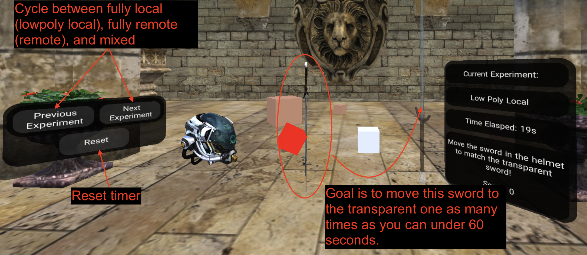

# RenderFusion Playground

Simulate split rendering on the web!

Visit https://edwardlu2018.github.io/renderfusion-playground to explore the playground.

This website artificially delays a virtual scene (simulating "remote rendering" with tunable network delays) and composites it
with a "locally rendered" virtual scene. It provides a series of knobs to play around with post-render warping (using
asynchronous time + space warping), and allows users to switch between rendering schemas.

Works on desktop, mobile, and WebXR-enabled devices like AR/VR headsets — tested on Valve Index (using SteamVR), Magic Leap 2,
Quest Pro, and Quest 2, but any modern headset should work.

Disclaimer: Some options (like enabling `Translation`) work best on a fairly good machine.

## GUI (2D)
Note: the 2D GUI is __not__ accessible in WebXR immersive sessions (if you click AR/VR button).


## GUI (3D)
Note: the 3D GUI is __not__ accessible outside WebXR immersive sessions (you need to click AR/VR button). The GUI can be
interacted with using a point-and-click headset controller.



## Development
```
git clone git@github.com:EdwardLu2018/renderfusion-playground.git
npm install
```

### Building

To build, run:
```
npm run watch   # for automatic rebuilds
```
or
```
npm run build   # for single build
```

### Serving

In a new Terminal, generate certs:
```
openssl req -x509 -newkey rsa:2048 -keyout ssl/key.pem -out ssl/cert.pem -days 365
openssl rsa -in ssl/key.pem -out ssl/newkey.pem && mv ssl/newkey.pem ssl/key.pem
```

Then, run:
```
npm run start
```

## License
See the [LICENSE](LICENSE) file.

If you find this project helpful for any research-related purposes, please consider citing our paper:
```
@inproceedings{renderfusion,
  author = {Lu, Edward and Bharadwaj, Sagar and Dasari, Mallesham and Smith, Connor and Seshan, Srinivasan and Rowe, Anthony},
  booktitle = {2023 International Symposium on Mixed and Augmented Reality (ISMAR)},
  title = {RenderFusion: Balancing Local and Remote Rendering for Interactive 3D Scenes},
  year = {2023}
}
```
